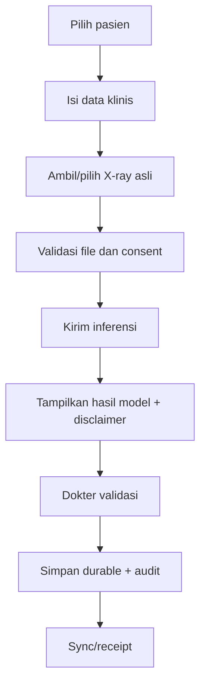

# Handbook Tim Frontend Mobile

## Mandat tim

Tim frontend memiliki pengalaman pengguna Android, integrasi API, state dan session lifecycle, local database, offline queue, camera/file input, validasi form, accessibility, serta kualitas artifact APK/AAB. UI tidak boleh menampilkan keberhasilan bila data belum durable.

## Setup dan menjalankan aplikasi

Prasyarat: Flutter 3.44.7, Android SDK/emulator, Java yang kompatibel, dan backend lokal untuk mode HTTP.

```powershell
C:\Users\devel\flutter\bin\flutter.bat pub get
C:\Users\devel\flutter\bin\flutter.bat analyze
C:\Users\devel\flutter\bin\flutter.bat test
```

Demo UI berbasis mock — bukan uji integrasi:

```powershell
C:\Users\devel\flutter\bin\flutter.bat run -d emulator-5554
```

Integrasi backend melalui Android emulator:

```powershell
adb reverse tcp:8000 tcp:8000
C:\Users\devel\flutter\bin\flutter.bat run -d emulator-5554 --dart-define=USE_HTTP=true --dart-define=API_BASE_URL=http://127.0.0.1:8000/api/v1
```

Alternatif tanpa `adb reverse`: gunakan `http://10.0.2.2:8000/api/v1`. Pastikan backend sudah berjalan dan health check lulus.

Baseline saat handover: 40 test lulus. Baseline bukan bukti flow klinis sudah production-ready.

## Peta codebase

| Kebutuhan | Lokasi awal |
|---|---|
| Bootstrap | `lib/main.dart` |
| Dependency wiring/mode repository | `lib/app/app.dart` |
| Route | `lib/app/router/app_router.dart` |
| Model dan repository contract | `lib/domain/` |
| HTTP client/repository | `lib/data/http/` |
| Mock data | `lib/data/mock/` |
| Drift DB | `lib/data/local/` |
| Offline repository | `lib/data/offline/` |
| Sync engine | `lib/data/sync/` |
| Screen/widget | `lib/features/` |
| Application state | `lib/state/` |
| Test | `test/` |

## Route pengguna

Route saat ini mencakup login, dashboard, patients, diagnosis, validation, dataset, sync, account, result, dan camera. Keberadaan route tidak berarti fiturnya sudah terhubung end-to-end.

## Mode data saat ini

| Domain | Wiring saat ini |
|---|---|
| Auth | HTTP atau mock berdasarkan `USE_HTTP` |
| Patient | Offline atau mock |
| Sync | Offline atau mock |
| Diagnosis | HTTP atau mock |
| Dashboard | Selalu mock |
| Validation | Selalu mock |
| Dataset | Selalu mock |

**KNOWN RISK:** `USE_HTTP` default `false`. Build tanpa define dapat menerima kredensial apa pun melalui mock auth dan menghasilkan diagnosis acak. Production build harus gagal jika mock mode aktif.

## Offline dan local data

Drift menyimpan pasien, diagnosis, antrean sync, dan settings. Aturan wajib:

- Semua operation memiliki stable client operation ID untuk idempotency.
- Status `pending`, `in_flight`, `failed`, dan `applied` mempunyai transisi/retry jelas.
- Logout/refresh failure membersihkan atau mengunci PHI cache sesuai policy.
- Token dipindahkan dari Drift plaintext ke secure storage.
- Konflik tidak disembunyikan sebagai sukses; UI memberi informasi dan recovery action.
- Migration Drift diuji dari minimal satu versi aplikasi yang telah dirilis.

## Alur diagnosis yang harus diwujudkan



Kondisi sekarang yang harus diketahui:

- Field form diagnosis belum seluruhnya tersambung ke state/request.
- Camera/upload dapat memakai placeholder 1x1, bukan X-ray sebenarnya.
- Failure inference dapat berpindah ke hasil kosong.
- Save/PDF/Print belum menghasilkan output durable.
- Validation repository masih mock dan verdict dapat tidak tersimpan.
- Fake model download dapat menandai versi sebagai installed tanpa artifact.

Jangan menambahkan toast “berhasil” sebelum server/local DB memberikan receipt yang dapat diverifikasi.

## Session dan keamanan mobile

1. Token tidak boleh masuk log, screenshot debug, analytics, atau plain SQLite.
2. Refresh failure harus mengubah global auth state dan menutup layar/data protected.
3. Jangan menaruh secret backend, signing key, atau model decryption key di source.
4. Hapus data sensitif dari recent-app preview bila policy mensyaratkan.
5. Terapkan timeout, cancel, retry terbatas, serta pesan error yang dapat ditindaklanjuti.
6. Jangan percaya response lama setelah account/tenant berganti.

## Definition of Done frontend

- Acceptance criteria termasuk loading, empty, offline, retry, timeout, dan accessibility.
- Tidak ada mock/no-op pada flow release yang diklaim selesai.
- `flutter analyze`, `flutter test`, dan codegen drift check lulus.
- Contract API cocok dengan generated OpenAPI backend.
- Test mencakup state transition, repository failure, dan widget flow utama.
- Divergensi offline/retry/logout diuji pada emulator/device.
- Release define, base URL, signing, version, dan permission diverifikasi bersama deployment.
- Dokumen dan backlog diperbarui.

## Minggu pertama tim frontend

1. Jalankan mock mode dan HTTP mode; catat perbedaan perilaku.
2. Trace login, patient list, diagnosis, validation, dan sync dari UI ke repository.
3. Reproduksi FE-001 sampai FE-010 secara lokal.
4. Tambahkan build guard untuk melarang mock mode pada release.
5. Prioritaskan diagnosis end-to-end, real image, durable save, retry, dan secure token sebelum polishing UI.

Backlog kanonis: `tasks/FRONTEND_TEAM_BACKLOG.md`.
